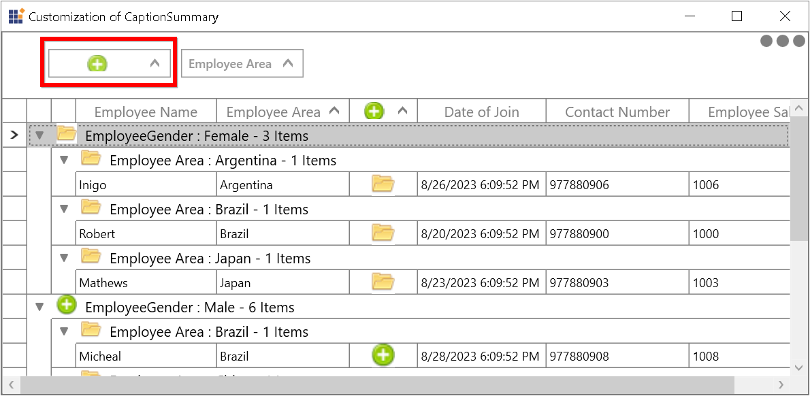

# How to Show the Image in GroupDropArea for Particular Column in WPF DataGrid?

This sample illustrates how to show the image in GroupDropArea for particular column in [WPF DataGrid](https://www.syncfusion.com/wpf-controls/datagrid) (SfDataGrid).

In `DataGrid`, you can add the image in GroupDropAreaItem for particular column in `DataGrid`. In that you can bind the [GridColumn.HeaderTemplate](https://help.syncfusion.com/cr/wpf/Syncfusion.UI.Xaml.Grid.GridColumnBase.html#Syncfusion_UI_Xaml_Grid_GridColumnBase_HeaderTemplate) to the content template of ContentPresenter.

``` xml
<Style TargetType="{x:Type Syncfusion:GroupDropAreaItem}">
    <Setter Property="Template">
        <Setter.Value>
            <ControlTemplate TargetType="{x:Type Syncfusion:GroupDropAreaItem}">
                <Border x:Name="PART_GroupDropAreaItemBorder"
                Background="{TemplateBinding Background}"
                BorderBrush="{TemplateBinding BorderBrush}"
                BorderThickness="{TemplateBinding BorderThickness}"
                Opacity="{TemplateBinding Opacity}"
                SnapsToDevicePixels="True">
. . . . 
. . . .
                    <Grid>
                        <Grid.ColumnDefinitions>
                            <ColumnDefinition Width="*" />
                            <ColumnDefinition Width="Auto" />
                        </Grid.ColumnDefinitions>
                        <Grid Grid.Column="0">
                            <Grid.ColumnDefinitions>
                                <ColumnDefinition Width="*" />
                                <ColumnDefinition Width="Auto" />
                            </Grid.ColumnDefinitions>
                            <ContentPresenter Margin="5" Grid.Column="0"
                                        HorizontalAlignment="{TemplateBinding HorizontalContentAlignment}"
                                        VerticalAlignment="{TemplateBinding VerticalContentAlignment}"
                                        Content="{Binding Path=GroupName,
                                                        RelativeSource={RelativeSource TemplatedParent},
                                                        Mode=TwoWay}" 
                                        ContentTemplate="{Binding Path=GridColumn.HeaderTemplate,
                                RelativeSource={RelativeSource TemplatedParent},
                                                        Mode=TwoWay}"/>                                   
. . . .
. . . .
                </Border>
            </ControlTemplate>
        </Setter.Value>
    </Setter>
</Style>
```



## Requirements to run the demo
Visual Studio 2015 and above versions